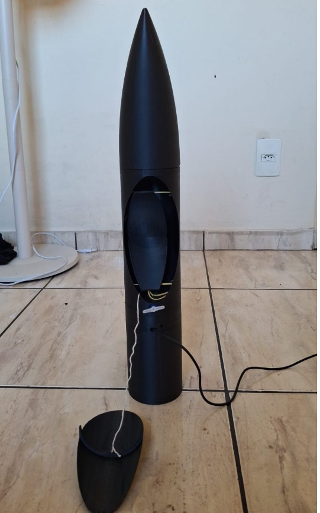
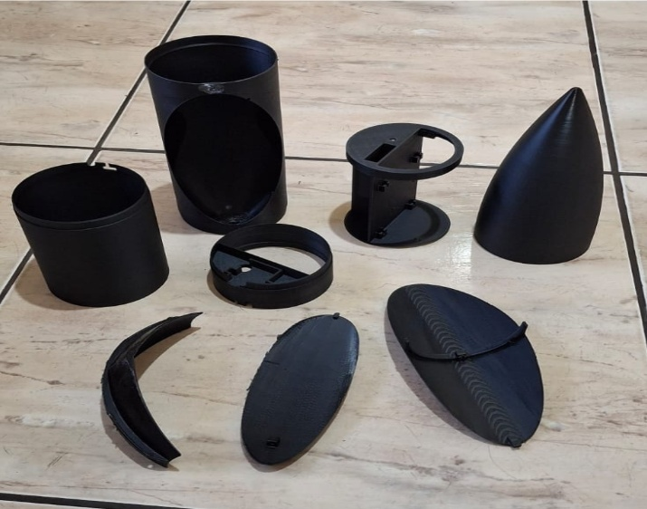

# Rocket Apogee Detection

**Embedded system for automatic apogee detection and parachute deployment in experimental rockets.**

This project presents the development of an embedded system designed to detect the apogee of an experimental rocket using barometric pressure measurements and automatically trigger a parachute deployment mechanism.

The system was developed using an **ESP32**, a **BMP085 barometric pressure sensor**, a **servo motor**, and a **buzzer**. The software was implemented in **C with ESP-IDF**, using **FreeRTOS**, a finite state machine, and a moving-average filter for pressure data processing.



## Objectives

The main objective of this project was to develop an embedded system capable of automatically detecting the apogee of an experimental rocket and activating a recovery mechanism.

The specific objectives were:

- Acquire atmospheric pressure data using a BMP085 barometric sensor.
- Process the pressure measurements using a moving-average filter.
- Detect the transition from ascent to descent.
- Implement a finite state machine for flight-state management.
- Use FreeRTOS tasks for concurrent system operation.
- Automatically activate a servo motor responsible for the parachute deployment mechanism.
- Provide an audible indication through a buzzer.
- Validate the system through controlled bench tests simulating ascent and descent.

## Hardware

The system was built around an **ESP32** microcontroller and a **BMP085** barometric pressure sensor. The pressure sensor communicates with the ESP32 through the **I²C** protocol.

The recovery mechanism uses an **SG90 servo motor**, while a **buzzer** provides an audible indication after apogee detection.

### Main Components

- ESP32 microcontroller
- BMP085 barometric pressure sensor
- SG90 servo motor
- Buzzer
- Protoboard
- Jumper wires
- USB cable

### Pin Configuration

| Component | ESP32 Pin |
|---|---|
| BMP085 SDA | GPIO 21 |
| BMP085 SCL | GPIO 22 |
| Servo | GPIO 13 |
| Buzzer | GPIO 12 |
| BMP085 VCC | 3.3 V |
| Ground | GND |



## Software

The embedded software was developed in **C using ESP-IDF** and organized into concurrent tasks using **FreeRTOS**.

The system is divided into three main tasks:

- **TaskSensor:** acquires pressure measurements from the BMP085 sensor.
- **TaskProcess:** processes the pressure data, applies the moving-average filter, and performs apogee detection.
- **TaskActuators:** controls the servo motor and buzzer after apogee detection.

Communication between tasks is handled using a **FreeRTOS Queue** for pressure data and **Task Notifications** for actuator commands.

## System Architecture

The system follows the sequence:

1. Initialize the ESP32 and connected peripherals.
2. Acquire pressure measurements from the BMP085.
3. Apply a moving-average filter to reduce measurement noise.
4. Detect the ascent phase through pressure variation.
5. Track the minimum pressure reached during ascent.
6. Detect the transition from ascent to descent.
7. Trigger the servo motor to activate the parachute deployment mechanism.
8. Activate the buzzer as an audible indication.

The system uses a **finite state machine (FSM)** with four states:

- **Armed**
- **Ascending**
- **Apogee Detected**
- **Finished**

## Apogee Detection Algorithm

Apogee detection is based on the variation of atmospheric pressure measured by the BMP085 sensor.

During ascent, atmospheric pressure decreases as the rocket gains altitude. The system therefore monitors the pressure measurements and identifies the ascent phase when the pressure decreases according to the configured threshold.

During ascent, the system continuously stores the lowest pressure measured. Afterward, when the pressure begins to increase consistently, the system identifies the transition from ascent to descent.

To reduce the influence of sensor noise and avoid false detections, the pressure data is processed using a **moving-average filter**. Apogee confirmation also requires multiple consecutive pressure increases.

### Detection Logic

```text
Armed
  ↓
Pressure decreases
  ↓
Ascending
  ↓
Record minimum pressure
  ↓
Multiple consecutive pressure increases
  ↓
Apogee Detected
  ↓
Activate servo
  ↓
Activate buzzer
  ↓
Finished
```
## Results and Validation

The system was validated through controlled bench tests designed to simulate the ascent and descent phases of a rocket.

During the tests, the ESP32 and pressure sensor were manually raised and lowered to reproduce variations in atmospheric pressure. Several tests were performed to calibrate the detection parameters and evaluate the behavior of the system.

The final system was able to:

- Acquire pressure measurements consistently.
- Detect the simulated ascent phase.
- Identify the transition from ascent to descent.
- Automatically trigger the servo after apogee detection.
- Activate the buzzer as an audible indication.

The tests also helped identify and mitigate issues related to sensor noise, pressure oscillations, premature apogee detection, and actuator behavior.

> **Note:** The validation was performed through bench tests. The system was not validated during an actual rocket flight.

## Limitations and Future Improvements

Although the system achieved the proposed objectives during bench testing, some limitations were identified.

The main limitation is that the system was not tested during an actual rocket flight. Real launches introduce accelerations, vibrations, and environmental conditions that are not reproduced by the bench tests.

The apogee detection algorithm also relies only on barometric pressure measurements. A more robust system could combine information from multiple sensors to improve flight-state estimation.

### Future Improvements

Possible improvements include:

- Testing the system during an actual rocket flight.
- Integrating an accelerometer and gyroscope for sensor fusion.
- Adding a microSD card for flight data logging.
- Implementing radio telemetry.
- Evaluating more advanced filtering techniques, such as a Kalman filter.
- Further improving the mechanical parachute deployment system.

## Repository Structure

```text
rocket-apogee-detection/
├── src/
├── images/
├── report/
└── README.md
```


### Etapa 9: Documentation

The complete technical report describing the project development, hardware, software architecture, apogee detection method, testing procedures, results, limitations, and future improvements is available in the `report/` directory.
